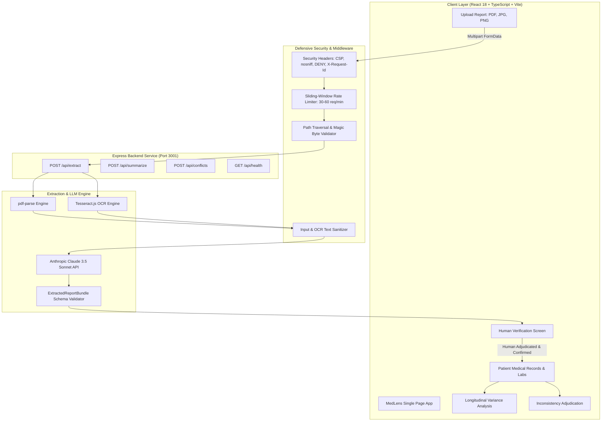

# MedLens — AI-Powered Clinical Information Intelligence

[-emerald.svg)](https://github.com/appuakhila10-ux/Medlens)
[](https://github.com/appuakhila10-ux/Medlens)
[](https://github.com/appuakhila10-ux/Medlens)
[](https://github.com/appuakhila10-ux/Medlens)

MedLens is a **Prototype / MVP** clinical document intelligence and provenance tracking platform built with **React 18**, **TypeScript**, **Node.js/Express**, and **Anthropic's Claude 3.5 Sonnet**. It ingests unstructured laboratory diagnostics (PDF, JPG, PNG), extracts structured biomarker panels via OCR and LLM, detects cross-document inconsistencies, and supports human-in-the-loop verification with clinical auditability.

> [!WARNING]
> **Prototype / Demonstration Sandbox Notice**:
> Persistence is provided via an embedded **SQLite backend, not yet encrypted at rest**, without user authentication yet. This build is an evaluation sandbox and clinical informatics proof-of-concept; it is **not** intended for real patient Protected Health Information (PHI) and carries **no** HIPAA or SOC-2 compliance certifications.

---

## 🛡️ Clinical Safety & Non-Diagnostic Guarantee

MedLens is strictly engineered as a **non-diagnostic clinical intelligence tool**:
- **NEVER Diagnoses**: The system never issues diagnostic determinations (e.g. `"diagnosed with"`, `"suffers from"`).
- **NEVER Suggests Treatments**: Never recommends medications, therapy changes, or dosage modifications.
- **Source-Anchored Status**: Biomarker status (`Normal`, `Low`, `High`, `Range unavailable`) is computed **strictly against the reference intervals printed on the source report**, never from speculative external medical knowledge.
- **Mandatory Disclaimer**: Every AI-generated synthesis strictly concludes with:
  > *"This summary organizes reported values and does not provide a diagnosis or medical recommendation."*
- **Source Provenance Badges**: Every clinical datapoint displays provenance metadata (`User provided`, `Extracted from report`, `AI generated`).

---

## 🏗️ System Architecture



---

## ✨ Core Features & Capabilities

1. **Document Ingestion & OCR**:
   - Ingests laboratory diagnostics across `.pdf`, `.jpg`, `.jpeg`, and `.png` formats.
   - Dual-engine OCR with `pdf-parse` for text PDFs and `Tesseract.js` for scanned documents/images.
   - Enforces a strict 25 MB file buffer cap, binary magic byte validation, and directory path traversal neutralization.

2. **Automated Structured Extraction**:
   - Queries Claude 3.5 Sonnet with zero temperature for deterministic, factual extraction.
   - Outputs standardized biomarker records: `testName`, `value`, `numericValue`, `unit`, `referenceRange`, `status`, `observation`, and `confidence`.

3. **Human-in-the-Loop Verification**:
   - Previews extracted lab biomarkers with extraction confidence scores (e.g. `96%`).
   - Enables clinicians to Edit, Confirm, or Reject values before committing to the patient's longitudinal record.

4. **Multi-Document Inconsistency / Conflict Detection**:
   - Cross-references newly verified reports against documented patient records (Allergies, Medications, Demographics, History).
   - Flags factual discrepancies (e.g., *Documented Penicillin Allergy* vs. *Reported NKDA*) without taking sides, queuing human adjudication.

5. **Longitudinal Variance Comparison**:
   - Compares previous vs. current laboratory metrics over time.
   - Calculates mathematical deltas with objective variance indicators without diagnostic claims.

6. **Patient Audit Timeline**:
   - Chronological audit ledger recording document uploads, AI extractions, clinical verifications, and record edits.

---

## 🚀 Quickstart & Setup

### Prerequisites
- **Node.js** v20.0.0+ (Tested on Node.js v24.19.0)
- **npm** v10.0.0+

### 1. Clone & Install Dependencies
```bash
git clone https://github.com/appuakhila10-ux/Medlens.git
cd medlens
npm install
```

### 2. Configure Environment Variables
Copy the `.env.example` template:
```bash
cp .env.example .env
```
Edit `.env` and provide your Anthropic API key:
```ini
ANTHROPIC_API_KEY=sk-ant-api03-YOUR_KEY_HERE
ANTHROPIC_MODEL=claude-3-5-sonnet-20241022
PORT=3001
```

### 3. Launch Development Server
Launch both the **Express Backend** (port 3001) and **Vite Frontend** (port 5173) concurrently:
```bash
# Windows One-Click:
run-medlens.bat

# Or via npm script:
npm run dev:all
```
Open your browser at **[http://localhost:5173](http://localhost:5173)**.

---

## 📡 API Reference

| Endpoint | Method | Description | Security Controls |
| :--- | :--- | :--- | :--- |
| `/api/health` | `GET` | Service health status & Claude API key check | Rate limited (60/min), `X-Request-Id` |
| `/api/patients` | `GET`, `POST` | List all patients or create new patient record in SQLite | Rate limited (60/min), input sanitization |
| `/api/patients/:id` | `GET`, `PUT`, `DELETE` | Retrieve, update, or delete single patient record in SQLite | Rate limited (60/min), input sanitization |
| `/api/reports` | `GET`, `POST` | List medical reports or register verified report in SQLite | Rate limited (60/min), input sanitization |
| `/api/reports/:id` | `GET`, `PUT`, `DELETE` | Retrieve, update status, or delete medical report | Rate limited (60/min) |
| `/api/tests` | `GET`, `POST` | Query tests by patient/report or batch insert tests in SQLite | Rate limited (60/min), input sanitization |
| `/api/tests/:id` | `GET`, `PUT`, `DELETE` | Retrieve, update values/status, or delete individual test | Rate limited (60/min) |
| `/api/conflicts-data` | `GET`, `POST` | List stored clinical conflicts or record new conflict in SQLite | Rate limited (60/min), duplicate protection |
| `/api/conflicts/:id` | `GET`, `PUT`, `DELETE` | Retrieve, update (resolve/acknowledge), or delete conflict | Rate limited (60/min) |
| `/api/extract` | `POST` | Multipart file upload $\rightarrow$ OCR $\rightarrow$ Claude clinical extraction | Magic bytes, traversal sanitization, 25MB cap, rate limited (30/min) |
| `/api/summarize` | `POST` | Verified patient labs $\rightarrow$ Non-diagnostic clinical narrative | Input XSS sanitization, non-diagnostic constraints, rate limited (30/min) |
| `/api/conflicts` | `POST` | Multi-source chart vs report inconsistency detection | Input XSS sanitization, rate limited (30/min) |

---

## 🧪 Automated Testing Suite (33 Tests, 6 Suites)

MedLens includes a zero-dependency automated test suite executed via Node.js's native test runner (`node:test` and `node:assert/strict`):

```bash
npm test
```

### Test Suites Overview:
1. **Backend Express API Endpoints & Transport Security** (`tests/api.test.js` - 5 tests):
   - Health check endpoint verification, `X-Request-Id` header inspection, CSP validation, `X-Powered-By` suppression, and 400 error handling on missing uploads.
2. **Clinical Safety & Non-Diagnostic Constraints** (`tests/clinicalSafety.test.js` - 6 tests):
   - Enforces mandatory non-diagnostic closing sentence, forbids disease claims, blocks medication/dosage recommendations, and validates missing range handling.
3. **Biomarker Extraction & Status Calculation** (`tests/extractor.test.js` - 7 tests):
   - Validates status assignment across bounds (`12.0 - 16.0`, `< 200`, `> 60`), and handles missing/unparseable values.
4. **Clinical Inconsistency Detection** (`tests/conflictDetector.test.js` - 4 tests):
   - Tests multi-document contradiction detection for allergies, medication dosages, concordant records, and schema validity.
5. **Security Layer & Defensive Controls** (`tests/security.test.js` - 5 tests):
   - Directly imports and tests production `server/middleware/security.js` functions: directory traversal neutralization, file extension filtering, magic byte validation, sliding-window rate limiting, and XSS sanitization.
6. **Storage & State Management** (`tests/storage.test.js` - 6 tests):
   - Tests patient CRUD operations, report storage, conflict creation, active conflict counts, and resolution tracking.

---

## ♿ WCAG 2.1 Level AA Accessibility Compliance

| WCAG Criteria | Implementation in MedLens |
| :--- | :--- |
| **1.3.1 Info & Relationships** | Explicit `<label htmlFor="id">` pairing across all modals; data tables feature `<th scope="col">` and descriptive `aria-label` attributes. |
| **2.1.1 Keyboard Accessible** | 100% keyboard navigable with high-visibility `focus-visible:ring-2 focus-visible:ring-blue-600` focus indicators. |
| **2.1.2 No Keyboard Trap** | Focus trap implemented in `Modal.tsx` keeping Tab navigation within the active modal; focus restored to trigger on close. |
| **2.4.1 Bypass Blocks** | Prominent `"Skip to main content"` bypass link targeting `<main id="main-content">`. |
| **2.4.3 Focus Order** | Logical DOM tabindex ordering and initial auto-focus on modal opening. |
| **3.3.1 Error Identification** | Dynamic validation errors paired via `aria-invalid="true"`, `aria-describedby="[field]-error"`, and `role="alert"`. |
| **4.1.2 Name, Role, Value** | Accessible dialog semantics: `role="dialog"` / `role="alertdialog"`, `aria-modal="true"`, `aria-labelledby`, `aria-describedby`. |
| **4.1.3 Status Messages** | Asynchronous notifications and toasts announced via `role="status"` and `aria-live="polite"`. |
| **1.4.3 Contrast (Minimum)** | All typography and UI badges meet or exceed the **4.5:1** contrast ratio (replaced sub-standard text-slate-400 with text-slate-500/600). |

---

## 🔒 Transport Security & Ingestion Defenses

The backend service implements defensive transport headers, request rate limiting, and upload inspection controls:

1. **Defensive HTTP Security Headers**:
   - `X-Content-Type-Options: nosniff` (prevents MIME sniffing).
   - `X-Frame-Options: DENY` (mitigates clickjacking attacks).
   - `X-XSS-Protection: 1; mode=block` (browser XSS filtering).
   - `Referrer-Policy: strict-origin-when-cross-origin` (prevents metadata leakage).
   - `Content-Security-Policy (CSP)`: Restricts script execution, styles, fonts, and API connections to trusted sources.
   - `X-Powered-By: Express` disabled to prevent server fingerprinting.
2. **Sliding-Window Rate Limiting**:
   - In-memory rate limiting throttling requests per IP (60 req/min general, 30 req/min for compute-heavy LLM routes) returning HTTP 429.
3. **File Upload Security & Magic Byte Inspection**:
   - Strict 25 MB memory cap.
   - Path traversal neutralization: `path.basename()` combined with null-byte (`\0`) and control character stripping.
   - Binary header inspection (`%PDF-` for PDFs, `\x89PNG` for PNGs, `\xFF\xD8\xFF` for JPEGs) preventing renamed malicious executables.
4. **Input & Narrative XSS Sanitization**:
   - Escapes HTML entities (`&`, `<`, `>`, `"`, `'`) and neutralizes `javascript:` / `data:` protocols across patient notes, symptoms, and raw OCR extracts.
5. **Secret Protection**:
   - `.env`, `.env.local`, and `server/.env` guarded by `.gitignore`.
   - Comprehensive `.env.example` templates provided.
   - Request correlation tracking via unique `X-Request-Id` headers.

---

## 📜 License

MIT License. Designed for clinical documentation assistance and information organization.
